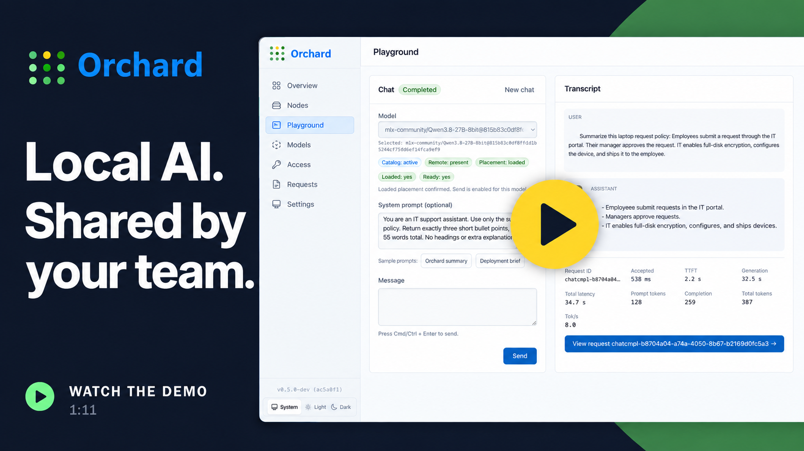
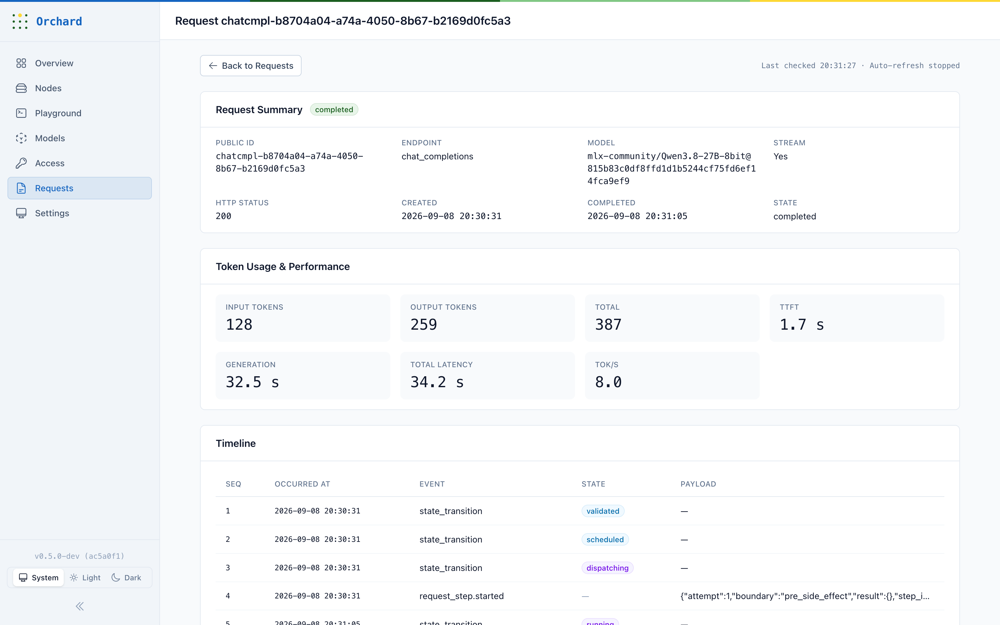
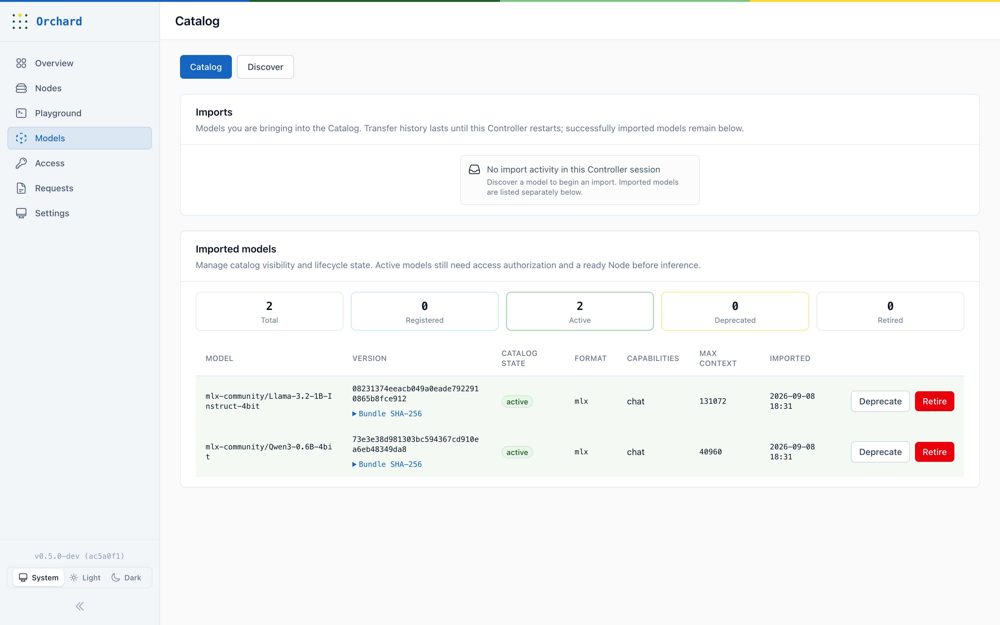
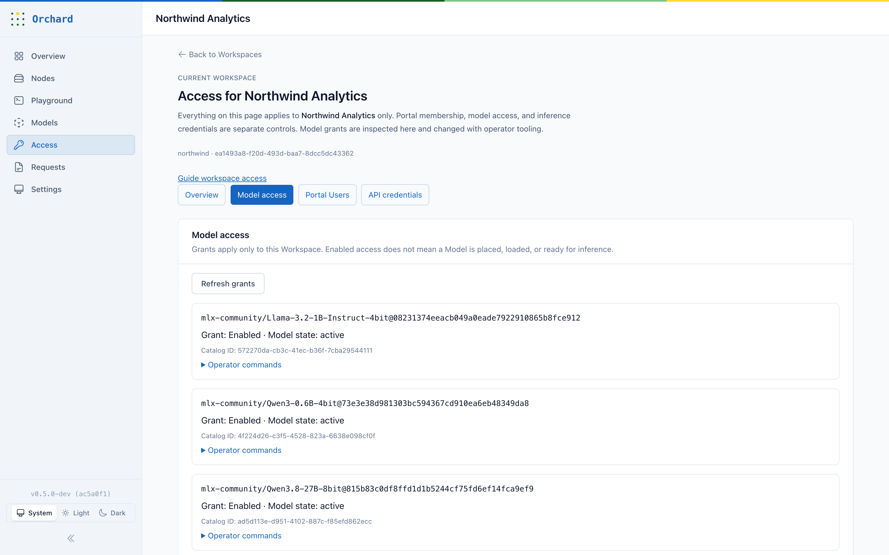
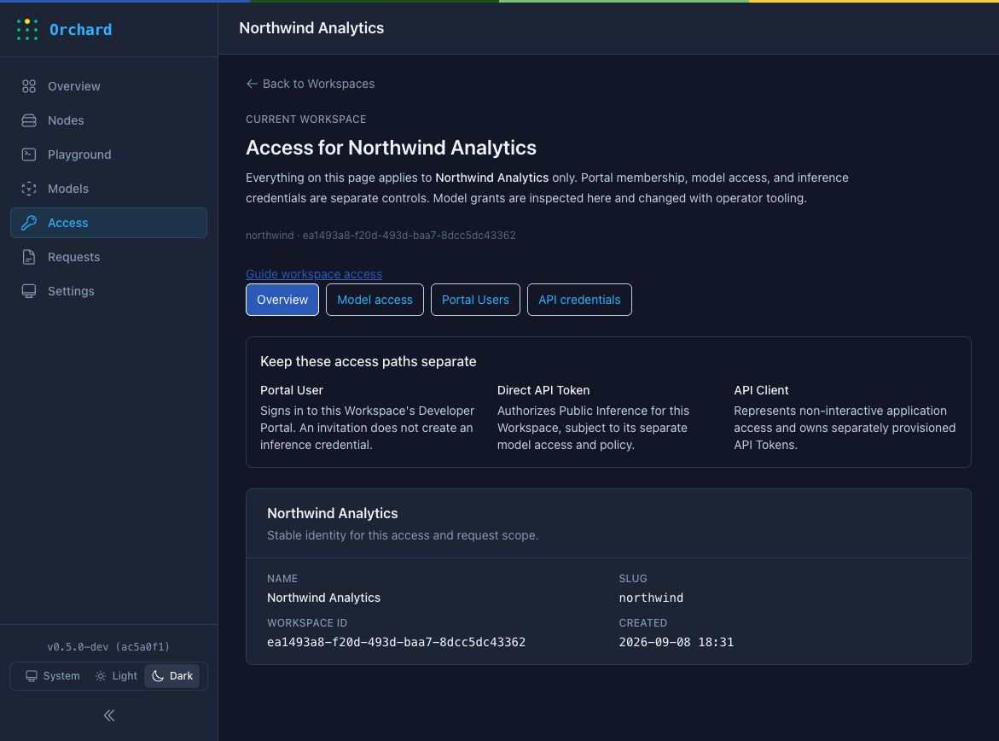

<p align="center">
  
</p>

<h1 align="center">Orchard</h1>

<h3 align="center">Your LLMs. Your hardware. Your rules.</h3>

<p align="center">
  Sovereign on-prem LLM orchestration for Apple Silicon Macs - OpenAI-compatible
  APIs, multi-tenant governance, and native macOS operations.
</p>

<p align="center">
  <a href="VERSION"></a>
  <a href="#current-status"></a>
  <a href="#quick-start"></a>
  <a href="docs/local-dev.md#api-endpoints"></a>
  <a href="https://github.com/ml-explore/mlx"></a>
  <a href="docs/local-dev.md#prerequisites"></a>
  <a href="LICENSE"></a>
</p>

<p align="center">
  <a href="https://github.com/kapitan-ai/orchard/actions/workflows/required-validation.yml"></a>
  <a href="docs/tooling.md"></a>
  <a href="docs/tooling.md"></a>
  <a href="mise.toml"></a>
  <a href="SPEC.md"></a>
  <a href="openspec/README.md"></a>
</p>

<p align="center">
  <a href="#quick-start">Quick start</a> ·
  <a href="docs/README.md">Documentation</a> ·
  <a href="SPEC.md">Build contract</a> ·
  <a href="CONTRIBUTING.md">Contributing</a>
</p>

Orchard turns Apple Silicon Macs into a shared internal LLM service.
Applications get one OpenAI-compatible endpoint, while operators control which Workspaces can use each model and can inspect how requests move through the system.
Inference runs with MLX-LM on hardware inside your network.

Running inference for a team means handling separate access, deny-by-default model grants, request visibility, scheduling, health, and day-two operations.
Orchard brings those responsibilities into one Elixir/OTP control plane backed by Postgres.

> **Experimental source-only publication.**
> Orchard is published here as source only under the Apache License 2.0, with Copyright 2026 AI Singapore, for covered Orchard-authored software and technical documentation.
> No official binary, supported release, SLA, or maintenance commitment is provided.
> Existing tags are pre-public development history and do not identify supported releases.

## See Orchard

Choose a model, try it in the Playground, and follow each request from generation to execution details.

[](https://youtu.be/lChCSLT3ra8)

*Run Qwen on your own Apple Silicon hardware and inspect the answer in the Playground.*

Follow the model catalog, Workspace access, live Qwen3.8 inference, and the same request's execution details.



*Inspect completion status, token usage, latency, and the execution timeline for each request.*

<details>
<summary>Model catalog and Workspace access</summary>

**Model catalog**



*The Model Catalog shows imported models and their lifecycle state.*

**Workspace model access**



*Workspace-scoped model grants remain separate from catalog state and inference readiness.*

**Workspace overview**



*The Workspace overview keeps portal membership, model access, and inference credentials distinct.*

</details>

## Why Orchard

- **Keep inference under your control.**
  Models run on Apple Silicon Macs in your environment with no cloud inference dependency.
- **Give teams one service boundary.**
  The Controller authenticates callers, applies Workspace policy, selects an eligible runtime, and relays the result.
- **Grant model access deliberately.**
  A model is unavailable to a Workspace until an operator grants it explicitly.
- **See what happened to a request.**
  Orchard records durable request state and scheduler explanations for diagnostics and accounting.
- **Keep the operating surface focused.**
  Postgres is the sole persistence and coordination layer, so the control plane does not require Kubernetes, Redis, Kafka, or a separate message broker.

Orchard is aimed at platform teams, regulated organizations, labs, and studios that want to share local inference without turning each Mac into a separately managed endpoint.

## Quick start

The current public path is source development on Apple Silicon macOS.
**Choose one setup method:** let a coding agent handle setup, or follow the manual instructions yourself.
Both paths reach the same result.

### With a coding agent (recommended)

Give your coding agent this prompt:

```text
Set up https://github.com/kapitan-ai/orchard on this Mac.
Clone the repository if needed, read AGENTS.md, docs/tooling.md, and docs/local-dev.md, and inspect the machine and any existing Orchard installation.
Install and configure prerequisites using the pinned toolchain and repository setup, including the optional MLX dependencies.
Start source development in an interactive session using the default single-node runtime.
Prepare a compatible model bundle, create a Workspace and API token, grant explicit model access, and verify a real API response.
If testing the Playground, grant Playground access explicitly.
Keep credentials private, preserve existing data, and report the Console URL plus the commands to stop and restart.
```

### Or, set up manually

Use this path if you are setting up Orchard without a coding agent.

Before running these commands, complete the [local development prerequisites](docs/local-dev.md#prerequisites): install mise, start PostgreSQL 15 or newer with TCP enabled, and provide the configured database role with database-create privileges.
You also need a local [Orchard Model Bundle](docs/local-dev.md#preparing-a-smoke-test-bundle-from-huggingface) before inference can run.
The repository pins the application toolchain in [`mise.toml`](mise.toml).

```bash
git clone https://github.com/kapitan-ai/orchard.git
cd orchard
make setup
mise exec -- uv sync --locked --directory native/orchard_worker_mlx --extra mlx
make dev
```

`make dev` creates the development database, runs migrations, and starts Orchard in the foreground.
The Console is available at `http://localhost:4000` and the source-development Node Agent gRPC endpoint listens on `127.0.0.1:50071`.
The extra `uv sync` installs the optional MLX worker dependencies needed for real inference on the Mac.

Starting the service does not make it inference-ready.
This all-in-one quick start uses Orchard's explicitly unmanaged source-development compatibility target while trusted admitted or active Node inventory is empty.
That local-only fallback does not create production Node inventory or grant production scheduling authority.
In the running IEx session, import and activate a Model Bundle, create a Workspace and direct API Token, then grant the Workspace access to the model.
The CLI currently uses `tenant` in these commands for the Workspace identifier.

```elixir
OrchardCLI.main(["models", "import", "/path/to/model-bundle", "--activate"])
OrchardCLI.main(["tenants", "create", "--slug", "dev", "--name", "Dev"])
OrchardCLI.main(["api-keys", "create", "--tenant-id", "<tenant-id returned above>", "--name", "dev"])
OrchardCLI.main(["models", "access", "grant", "<model_id>@<version>", "--tenant", "dev"])
```

Copy the one-time API Token printed by `api-keys create` into `ORCHARD_API_KEY` in the shell where you will call Orchard.
Use the exact `<model_id>@<version>` printed by `models import` in both the access grant and the request below.
Catalog activation, Workspace access, and runtime residency are separate states.
The [local development guide](docs/local-dev.md) covers Model Bundles, routing policies, residency, Console Playground access, and multi-host setup.

```bash
printf 'Orchard API Token: ' >&2
read -r -s ORCHARD_API_KEY
export ORCHARD_API_KEY
printf '\n' >&2

curl -X POST http://localhost:4000/v1/chat/completions \
  -H 'Content-Type: application/json' \
  -H "Authorization: Bearer ${ORCHARD_API_KEY}" \
  -d '{
    "model": "<model_id>@<version>",
    "messages": [{"role": "user", "content": "Hello from Orchard"}]
  }'
```

Treat this first request as the end-to-end inference check.
It succeeds only when the API Token resolves to the Workspace, the exact model is active and granted, and the configured local runtime has the model loaded or can load it within the routing policy's cold-start budget.
The [Node enrollment and admission flow](docs/local-dev.md#two-node-source-dev-cluster-testing) is a separate lifecycle and multi-host testing path with additional transport and identity requirements.
`/v1/responses` is Orchard's canonical inference abstraction.
`/v1/chat/completions` is a compatibility facade, and `/v1/models` lists only active models granted to the calling Workspace.
See the [API examples](docs/local-dev.md#api-endpoints) for streaming and Responses requests.

## What Orchard includes

**Controller**

The Elixir/OTP Controller authenticates requests, resolves Workspace policy, schedules work, relays token streams, and records durable request state.
Applications call the Controller rather than individual model workers.

**Node Agent and MLX workers**

Each inference Mac runs a Node Agent that manages local model artifacts and MLX-LM workers.
Workers stay behind the Node Agent and are not exposed as public endpoints.

**Console and CLI**

The Phoenix LiveView Console presents nodes, models, Workspaces, keys, request inspection, settings, and a Playground.
`orchardctl` covers bootstrap, model import and access, node trust and enrollment, lifecycle actions, transport setup, and diagnostics.

**Postgres**

Postgres stores control-plane state and coordinates leadership and work.
Current Controller-bearing installations require operator-provided external Postgres.

```text
Applications and SDKs
         |
     HTTPS + SSE
         |
 Orchard Controller -------- Postgres
         |
 Runtime Endpoint interface
         |
     Node Agent
         |
   MLX-LM workers
```

Read [`docs/architecture.md`](docs/architecture.md) for runtime boundaries and the repository map.

## Current status

Orchard is pre-release software at `0.5.0-dev` and is being developed against the normative [`SPEC.md`](SPEC.md).
Implemented behavior and target architecture are intentionally described separately.

Available in the current source tree:

- Authenticated `/v1/models` and `/v1/chat/completions`, including server-sent event streaming.
- A bounded `/v1/responses` subset.
- Workspace-scoped API Tokens, API Clients, and deny-by-default model access grants.
- The Console, Developer Portal, Prometheus metrics, and request diagnostics.
- Node trust initialization, single-node enrollment and join, admission review, and bounded lifecycle actions.
- Client-executed function-tool passthrough for model configurations that carry the `tool_calling` capability.
  Catalog admission of that capability is static artifact evidence, not qualification; see [`docs/model-qualification.md`](docs/model-qualification.md).

Current limits:

- The ordinary source-development path is single-node on Apple Silicon macOS.
- Production multi-node scheduling, Active/Standby failover, full configurable Workspace quota policy, and managed Postgres are incomplete.
- The accepted Linux Controller profile is not supported until its mixed-platform acceptance gates pass.
- Tool calls are returned to the client for execution.
  Orchard does not execute client-supplied tools on the server in base v1.
- Model support depends on qualification of the exact model, artifacts, runtime, Orchard revision, hardware, and operating policy.
- There is no supported public binary.

The approved native macOS distribution design is a signed and notarized DMG containing `Orchard.app` with launchd-managed services.
Any public binary requires a separate release decision and completion of its build, verification, signing, notarization, stapling, and publication gates.
See [`packaging/dmg/README.md`](packaging/dmg/README.md) for those gates.

## Documentation

- [`docs/local-dev.md`](docs/local-dev.md) explains source setup, Model Bundles, API examples, routing policy, and multi-host development.
- [`docs/architecture.md`](docs/architecture.md) explains components, runtime boundaries, and qualified platform profiles.
- [`docs/operator-journey.md`](docs/operator-journey.md) describes current and target operator workflows.
- [`docs/pilots/README.md`](docs/pilots/README.md) defines the current source-development pilot bar.
- [`SPEC.md`](SPEC.md) is the normative product and system contract.
- [`docs/README.md`](docs/README.md) maps the rest of the documentation.

## Developing Orchard

Orchard is an Elixir/OTP umbrella application with Phoenix LiveView, Postgres, native MLX integration, and macOS packaging work.
Use the repository command surface and the pinned toolchain documented in [`docs/tooling.md`](docs/tooling.md).

```bash
make test
make check-elixir
```

Read [`CONTRIBUTING.md`](CONTRIBUTING.md) before proposing a change.
[`AGENTS.md`](AGENTS.md) defines the automation workflow, and [`CLAUDE.md`](CLAUDE.md) imports it for Claude Code.
Substantial behavior and architecture changes use the [OpenSpec workflow](openspec/README.md) under `SPEC.md`.

## License

Covered Orchard-authored software and technical documentation in this repository are licensed under the [Apache License, Version 2.0](LICENSE).
Copyright 2026 AI Singapore.

This experimental publication is source-only.
It provides no official binary, supported release, SLA, or maintenance commitment.
Third-party software, models, tokenizers, assets, and other separately licensed material are excluded from this grant and retain their own terms and notices.
See [`THIRD_PARTY_NOTICES.md`](THIRD_PARTY_NOTICES.md) for tracked third-party notices.
The Orchard logos and distinctive brand assets are excluded from this grant, including `apps/orchard_controller/priv/static/images/` and `assets/brand/`.
No trademark rights are granted.
